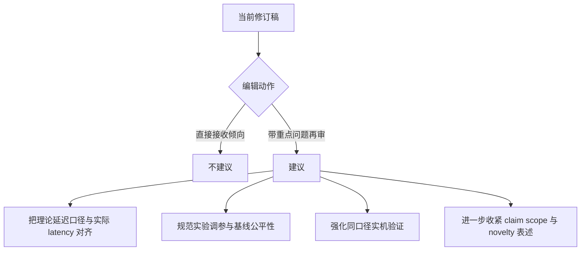

# 学术稿件大修审计报告

## 执行摘要

这是一份**认真且实质性的大修**。作者确实按审稿意见重写了问题表述、修正了内存约束的定义、删除了原稿中误导性的“heavy traffic”表述、把开放系统下的“吞吐”重新表述为**稳定域/有效完成率**问题，并把实验从“时间轴/样本序号图”改成了**到达率扫描下的延迟—完成率图**；此外还补上了 A100 计时校准、长输出压力测试、阈值但不等待的对照、以及实机 SGLang 运行的补充实验。与原稿相比，修订稿的 exposition、建模口径、实验组织和 response letter 的对应关系都有明显改善。fileciteturn0file2 fileciteturn0file7 fileciteturn0file4 fileciteturn0file1 fileciteturn0file0

但如果问题是：**这篇论文是否已经把所有关键接受风险都压到很低，可以直接据此判断“基本可接收”**，我的结论是否定的。当前仍有三类会影响最终接受概率的残留风险：第一，理论部分对“latency/TTFT”的主结果仍以**service-normalized delay**呈现，而不是直接给出与论文应用口径一致的日历时间延迟结论；这只部分回应了最负面审稿人关于“延迟被忽视/理论上没有真正回答 latency”的核心批评。第二，实验虽然明显比原稿更好，但 WAIT/Nested WAIT 的参数是**按到达率逐点离线标定**的，而基线主要采用固定/默认配置；这会让“性能提升来自调参还是来自算法本身”仍留有疑问。第三，所谓“real-GPU validation”更多是**sanity check**，而不是与主实验同口径、同基线、同指标的强验证。fileciteturn0file2 fileciteturn0file4 fileciteturn0file0

因此，我的总体判断是：**该稿已足够支撑“进入下一轮评审/再审”**，但**尚不足以支撑“作者已充分解决所有关键问题，论文已可直接正面处理”**。若由 AE 做程序性判断，我会建议：**允许带重点问题进入再审**，而不是以当前版本直接形成接收倾向。fileciteturn0file7 fileciteturn0file2

## 总体判断

从编辑判断角度看，AE 与两位较温和审稿人的**大部分明确问题已经被实质性处理**：记号混乱、policy space 缺失、内存约束只约束当前 batch 的漏洞、preemption/eviction 口径不清、Equation (1) 没有说明适用工况、实验参数不透明、缺少长输出和 GPU 校准等，都在修订稿与 response letter 中得到了直接回应。最负面的 Referee 3 的四条主批评里，“heavy traffic 误称”“开放系统吞吐口径不对”“不应只在不稳定区间看 latency”“内存约束建模不清”这几条也都**不再是原样成立的批评**。fileciteturn0file5 fileciteturn0file6 fileciteturn0file2 fileciteturn0file4 fileciteturn0file0

但仍需要区分“**回应了审稿意见**”与“**已经足以过刊物门槛**”这两件事。当前版本更接近前者，而非后者。原因不是它没有改，而是**剩下的问题更集中在接受门槛最敏感的地方**：理论结论与应用主张的对齐、实验比较的公平性与外推力度、以及 novelty 的最终说服力。AE report 已明确指出，这篇稿件的风险并不只是 typo 或 exposition，而是“澄清后可能暴露出此前被写作掩盖的技术问题”。从目前修订稿看，写作风险已经下降，但“理论与证据是否足够强”这个问题仍未完全关掉。fileciteturn0file7 fileciteturn0file4 fileciteturn0file0

| 结论项 | 判断 |
|---|---|
| 是否完成了“认真大修” | 是 |
| 是否大体回应了 AE / R1 / R2 的多数明确意见 | 是 |
| 是否部分化解了 Referee 3 的核心概念性批评 | 是 |
| 是否还存在会影响接受决策的高优先级问题 | 是 |
| 是否建议直接按“基本满足，可接受”推进 | 否 |
| 是否建议允许进入下一轮再审 | 是 |

## 高优先级剩余问题

下表只列**仍可能影响接受**的剩余问题，而不是已经解决的旧问题。相关判断基于原稿、修订稿、response letter、两份评审报告、AE report 与决定信的交叉核查。fileciteturn0file1 fileciteturn0file0 fileciteturn0file4 fileciteturn0file5 fileciteturn0file6 fileciteturn0file7 fileciteturn0file2

| 严重度 | 剩余问题 | 位置 | 为什么重要 | 建议修复 |
|---|---|---|---|---|
| **High** | 理论的 latency/TTFT 结果仍主要以 **service-normalized** 量呈现，和论文主实验、主叙事中的实际端到端延迟口径并不完全一致 | 修订稿 Sec. 4.3（约 pp. 21–24）、Sec. 5.2（约 pp. 29–31）、Appendix D/E（约 pp. 61–74） | 这正对应 Referee 3 关于“latency 不是被真正回答”的核心批评。现在比原稿清楚了，但理论主结果仍然不能直接支持“实际 latency 改善”的中心叙事；在 OR 审稿语境下，这会削弱理论贡献与应用 claim 的闭环 | 在主文增加一个明确 corollary：把当前 scaling 下的 service-normalized delay 结论转换为实际 calendar-time 口径；如果做不到，应在摘要、贡献点、理论小结中**显式收缩 claim**，说明理论保证对应的是规范化延迟，而实际延迟证据主要来自实验 |
| **High** | 主实验存在**按到达率逐点离线调参**的成分，而基线没有看到同强度的调参协议 | 修订稿 Sec. 6.1–6.2（约 pp. 33–39），尤其 real-data 中按每个 arrival rate 从 tl 与 segment 数网格中选最低延迟配置；Appendix H.2 GPU real-data 也按 rate 分配不同 tl/segments（pp. 84–85） | 这会留下“收益是否来自更强的 rate-aware tuning，而不只是算法结构”的疑问；对 editorial decision 来说，这属于实验公平性与可重复性的核心风险 | 统一成一个**可复现实验协议**：要么给基线也做同级别调参；要么给 WAIT/Nested WAIT 固定少量全局参数，不随 arrival rate 逐点选优；至少增加敏感性图与“训练/验证”式校准流程描述 |
| **Medium-High** | 实机 GPU 验证与主实验口径不完全一致，更多是校准/补充，而不是直接验证主结论 | 修订稿 Appendix H.2（约 pp. 82–85） | 作者补了 A100 计时校准和 SGLang 实机对照，这是加分项；但它没有直接按主文的同一基线集合（vLLM、Sarathi）、同一 workload 规模、同一 completion-rate / eviction-rate 指标来复现主结论，因此“simulator fidelity + algorithm effect”仍未完全闭环 | 至少补一个代表性 workload 的**同口径实机表**：给出 latency、effective completion rate / goodput、eviction-induced restart、以及多次运行方差；若做不到，应把摘要和 Section 6 中对真实 GPU 的表述明确降为“supporting validation” |
| **Medium** | “未知输出长度”问题的 claim scope 仍略大于实际算法假设 | 修订稿 Abstract（p. 1）、Sec. 5（约 pp. 25–31）、Sec. 6.2（pp. 37–39） | Nested WAIT 的在线决策不使用单请求真实最终长度，这一点成立；但阈值设计仍依赖输出长度类、到达率或经验分布/continuation probability 的校准。若不明确，容易被解读为“对未知输出长度且无先验分布也鲁棒” | 在 abstract、contribution、section intro 中补一句限定：方法处理的是**per-request 输出长度未知，但 workload-level 分布/到达率可估或可校准**的情形；增加 misspecification / distribution shift 的敏感性实验最佳 |
| **Medium** | 理论 novelty 的定位虽然改善，但“新的数学难点在哪里”仍需更短、更硬的概括 | 修订稿 Sec. 3–5 与 Appendix D/E | 现在作者已把贡献重心转向“建模 + state reduction + boundary queues”，方向是对的；但对 Referee 3 来说，仍可能觉得证明本体接近标准反射随机游走/Kingman/Lindley 工具的组合，而新意更多在 framing | 建议在主文 theorem 前后加入一个**一段式 novelty box / proposition of difficulty**：明确三点——原始状态为何高维、WAIT/Nested WAIT 如何把其降到 entry/boundary queues、为什么这一步不是标准 open queue 直接套正再生/正再返即可 |

## 逐点核查清单

下表按“原始关切 → 作者回应 → 修订稿落点 → 本次审计判断”给出 consolidated checklist。状态分为：**Fully addressed / Partially addressed / Not addressed**。表中“位置”是 best-effort 的节/页定位。fileciteturn0file4 fileciteturn0file5 fileciteturn0file6 fileciteturn0file7 fileciteturn0file2 fileciteturn0file0

| 来源 | 原始关切 | 作者回应是否对口 | 修订稿位置 | 状态 | 审计结论 |
|---|---|---|---|---|---|
| AE | 需要 complete expositional overhaul，不能只是修 typo | 对口 | Sec. 1–5 全文重写；Notation Summary；Appendix 重组 | **Fully addressed** | 修订稿显著更清楚，结构和叙述都比原稿专业得多 |
| AE | 线性 iteration-time、OOM、preemption 需修改或强论证 | 对口 | Sec. 2.2–2.4，Appendix H.2/H.4 | **Partially addressed** | 口径已清楚，A100 校准也补了；但模型仍偏 decode-heavy/PD setting，外推仍有限 |
| AE | 理论新意需澄清：建模贡献还是新数学？ | 对口 | Sec. 1.1、Sec. 3–5 | **Partially addressed** | 立场已收缩到 modeling + threshold state reduction，但说服力尚未完全封口 |
| AE | 要更好接到 stochastic modeling / scheduling literature | 对口 | Introduction related work | **Fully addressed** | 相关工作与定位明显改善 |
| R1 | 如何避免 KV cache 超容量/OOM | 对口 | Sec. 2.3、Example 1/2/3、Sec. 6 | **Fully addressed** | 这条在修订稿里已经从“模糊”变成“显式且可检验” |
| R1 | Equation (1) 线性假设与 GPU 架构差异 | 对口 | Sec. 2.2，Appendix H.2，H.4 | **Partially addressed** | 作者说明了适用工况并做了 A100 校准，但并未证明更广泛鲁棒性 |
| R1 | 记号混乱 | 对口 | Sec. 2、Notation Summary | **Fully addressed** | 原稿中的核心符号冲突基本消失 |
| R1 | policy class / batching operation 不清 | 对口 | Sec. 2.4 | **Fully addressed** | Π 与决策口径现在是可理解的 |
| R1 | 算法后要有直觉解释 | 对口 | Example 2/3、Sec. 4.2、5.1 | **Fully addressed** | 解释性大幅增强 |
| R1 | typo / d vs d1 / Thoughput | 对口 | 全文 | **Fully addressed** | 我未再看到原先最显眼的错误 |
| R2 | Equation (1) 省略 prefill attention / linear layer，需说明 regime | 对口 | Sec. 2.2，Appendix H.2/H.4 | **Partially addressed** | 回应是合理的，但仍是“说明适用范围”，不是更强建模 |
| R2 | 𝐶 ≥ 𝑀* 不轻松，长输出下可能过强 | 对口 | Sec. 3–4，Table 2，long-decode experiments | **Partially addressed** | 作者现在承认其是 fluid stabilizability 条件，并用真实数据表支持；但理论依赖仍强 |
| R2 | Theorem 1 的 decode-stage dynamics 证明不清 | 对口 | Sec. 4.3，Appendix D、G | **Partially addressed** | 现在比原稿可验证得多，但关键 dominance/coupling 段落仍偏 sketch-like |
| R2 | 阈值但不等待的替代算法 | 对口 | Appendix H.1 | **Fully addressed** | 实验上已经单独补了 |
| R2 | asymptotic assumption / heavy traffic 角色要说清 | 对口 | Sec. 4.3、5.2、response D.1 | **Fully addressed** | “heavy traffic”误称已纠正 |
| R2 | 参数、batch size、memory、Sarathi config、复现性 | 对口 | Sec. 6 开头、Sec. 6.2、Appendix H.2 | **Partially addressed** | 细节明显增加，但 per-rate tuning 仍引出公平性问题 |
| R2 | Vidur 要做 real-GPU validation | 对口 | Appendix H.2 | **Partially addressed** | 做了，但验证口径不够完整 |
| R2 | 长输出 >1000 | 对口 | Sec. 6.1 long-decode | **Fully addressed** | 压力测试已加 |
| Referee 3 | “heavy traffic”其实不是 heavy traffic | 对口 | Sec. 4.3/5.2 改述；response D.1 | **Fully addressed** | 这条批评已被正面吸收 |
| Referee 3 | 开放系统中吞吐不是固定 arrival 下要优化的对象 | 对口 | Sec. 2.4、3.2、6 | **Fully addressed** | 修订稿已改成有效完成率/稳定域表述 |
| Referee 3 | 原实验主要在不稳定区，latency 比较意义弱 | 对口 | Sec. 6 arrival-rate curves + Table 2 + long-horizon check | **Fully addressed** | 现在实验设计与这条批评基本对齐 |
| Referee 3 | latency 理论/算法贡献仍不够强 | 对口但不彻底 | Sec. 4.3、5.2、Sec. 6 | **Partially addressed** | 实验比原稿强很多，但理论 latency 口径仍不够“直给” |
| Referee 3 | 内存约束只对当前 batch，不现实 | 对口 | Sec. 2.3–2.4 | **Fully addressed** | 这是当前修订中最清晰、最成功的一处修复 |
| Referee 3 | 写作不清，缺少定义与解释 | 对口 | 全文 | **Fully addressed** | 已不再是阻断性问题 |

## 技术与实证复核

**证明/推导方面。**  
修订稿相较原稿，最大的技术改进不是“增加了更多数学”，而是把原来难以核查的证明组织成了可读的结构：主文在 Theorem 1/2 前后增加了机制解释，Appendix D/E 明确区分了 comparison-slot index、decode-stage index、entry queue、boundary queue、dominating process，并显式引用了 Lindley、Kingman、随机游走最大值与 martingale tail 工具。就“是否修复原稿里明显的证明呈现缺陷”而言，答案是肯定的。fileciteturn0file1 fileciteturn0file4 fileciteturn0file0

但如果更严格地问“这些证明是否已经把最负面审稿人关于理论平凡性与 latency 口径的担忧完全消除”，答案仍是否定的。原因不在于公式错误，而在于：主文现在确实说明了 WAIT/Nested WAIT 如何把高维 LLM serving 状态压缩成 threshold/boundary queues，可是**延迟结论仍然主要落在一个经缩放的时间口径上**，而不是直接给出编辑最关心的 operational delay result；同时，多类型 WAIT 的 one-slot delayed comparison dominance 虽然比原稿清楚，但读者仍要跨 Appendix D/G 才能确信“resident stage advancement”与“entry cohort removal”之间的对应关系已经足够严密。这不是致命漏洞，但仍是再审时最可能被继续追问的证明点。fileciteturn0file2 fileciteturn0file4 fileciteturn0file0

**实验方面。**  
作者对 Referee 3 的实验批评回应得相当到位：原稿主要用“随时间 horizon 的 throughput 曲线”和“随 prompt number 的 latency 曲线”；修订稿把主图改成了“arrival rate → mean latency / effective completion rate”的标准 queueing 呈现，并增加了 near-overloaded 到 overloaded 的 transition check、long-decode workload、真实数据上的 fluid memory crossing table，以及 repeated-run variability。就“实验是否仍停留在明显不稳定区而无法解释 latency”这一核心批评而言，修订稿已经基本过关。fileciteturn0file1 fileciteturn0file2 fileciteturn0file4 fileciteturn0file0

剩余实验风险主要是**公平性与外部效度**，而不是“有没有做实验”。修订稿明确写出 WAIT/Nested WAIT 在不同 workload/arrival rate 下通过 tl、segment 数、continuation probability 等做 rate-aware calibration；这当然可以被辩护为“已知 offered load 的部署前调参”，但若用于与默认/固定基线直接比较，编辑仍可能要求更严格的 protocol。另一个风险是，实机 GPU 实验虽然存在，但采用的是 SGLang baseline，而非主文对比对象的全套同口径复现，因此它更像“方向正确的补充证据”，不是完全闭环的验证。fileciteturn0file4 fileciteturn0file0

**写作与 claim scope。**  
这一轮大修最成功的部分就是写作。原稿中“只约束当前 batch 的内存”“Π 一边说 non-preemptive、一边又允许 preemption”“heavy traffic 实际是 long-horizon scaling”“开放系统吞吐叙事有误导性”等地方，都已被显式改写。response letter 对这些修改的描述与修订稿正文基本一致，没有发现“回复信说改了，但稿件里没落下去”的重大失配。fileciteturn0file1 fileciteturn0file4 fileciteturn0file0

当前更需要控制的是**claim scope**。修订稿比原稿克制得多，但 abstract、贡献点和 Section 5 的整体语气仍容易让读者先入为主地理解为：作者不仅解决了“未知输出长度”，还在理论上强力回答了 latency；而实际上，前者依赖 workload-level distribution / rate calibration，后者在理论上仍带有 normalization。若作者在 resubmission 前再主动缩紧这两个 claim，反而会让整篇论文更稳。fileciteturn0file4 fileciteturn0file0

## 编辑决策建议

我的建议不是“拒稿”，而是**带重点问题继续推进再审**。这份 revision 已经跨过了“写作过差导致无法判断”的门槛，也确实把多项关键批评转化成了论文中可以检查、可以讨论的对象；从程序正义上说，它值得进入下一轮评审。fileciteturn0file7 fileciteturn0file2 fileciteturn0file0

但如果 AE 需要一个更尖锐的 yes/no 结论，我会写成：

**建议结论：**  
**可以进入再审；不建议当前版本直接按“问题已基本解决、接收风险很低”处理。**

**给作者的聚焦修改要求应当只保留三条：**  
一是把理论 latency/TTFT 结论与实际延迟口径彻底对齐，或者明确降格表述；二是把实验调参协议、基线公平性与复现实验说明再做一层规范化；三是把 real-GPU evidence 提升为至少一个与主实验同口径的验证点。若这三条补齐，我认为下一轮的主要争议会从“概念性漏洞”缩小到“刊物口味/贡献强度判断”，而不再是“稿件是否站得住”。fileciteturn0file4 fileciteturn0file0

**开放问题 / 限制**  
由于当前可核查材料以作者提交的原稿、修订稿、response letter、AE report 和两份 reviewer report/决定信为主，本报告能审计“是否回应了意见”和“是否仍有接受风险”，但不能替代独立复现实验或逐行形式化验算。对 Appendix D/E 的完全形式正确性，我的判断是“**比原稿可核查得多，但仍建议再审时重点盯住**”，而不是“已无任何证明风险”。fileciteturn0file7 fileciteturn0file2 fileciteturn0file0